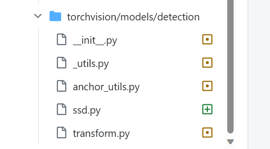

# Hybrid pruning
## Prepare environment for hybrid pruning
1. Setup envronment for anchor pruning
    - Follow the [instruction](https://github.com/Mxbonn/anchor_pruning#installation) to setup the environment.
2. Add support for SSD model
    - Since there is no SSD model in torch vision 0.9.0, we have to add needed files into our environment manually.
    - You can find the files [here](https://github.com/pytorch/vision/tree/release/0.10/torchvision/models/detection).
    - Required files are: 

3. Add our custom model parts
    - Put "ssd_load_.py" into "mmdet/models/backbones/".
    - Put "direct_.py" into "mmdet/models/necks/".
4. Modify mmdet
    - Replace "coco.py" with our modified version. 
    ("mmdetection\mmdet\datasets\coco.py")
    - Replace "base_dense_head.py" with our modified version. ("mmdetection\mmdet\models\dense_heads\base_dense_head.py")
    - These modifications fix the issue of different coco classes number and backgroound cat_id.

## Usage
See [Hybrid_pruning_combine2methods.ipynb](Hybrid_Pruning/code/Hybrid_pruning_combine2methods.ipynb)
